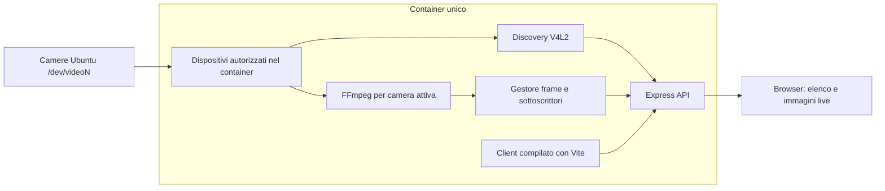

# Ubuntu Camera Viewer — specifiche e piano di sviluppo

Documento utilizzabile come prompt autonomo per una successiva implementazione. Questa consegna comprende esclusivamente progettazione: non creare codice, configurazioni eseguibili o container durante la fase di specifica.

## 1. Obiettivo e vincoli

Realizzare un'applicazione che elenca le telecamere collegate al sistema Ubuntu ospitante e permette di selezionarne una per vedere le immagini in diretta dal browser.

- Backend Node.js con Express; client React e TypeScript compilato tramite Vite.
- Un solo container di produzione: Express espone API, immagini e file statici compilati del client sulla stessa porta, predefinita `3000`.
- FFmpeg viene eseguito come processo figlio nello stesso container. Nessun server multimediale o database esterno.
- Processo applicativo eseguito da utente non root.
- Applicazione utilizzabile sia su `/` sia su un context path, per esempio `/camera/`.
- Modelli TypeScript in file dedicati; ogni componente React in un file separato.
- Il browser visualizza le camere del server Ubuntu: non richiedere `getUserMedia` o permessi per la webcam del computer client.

## 2. Perimetro della prima versione

### Incluso

1. Rilevamento delle sorgenti video V4L2 visibili al processo.
2. Elenco con nome, identificativo, dispositivo e stato noto.
3. Selezione esplicita della camera e avvio/arresto della visualizzazione.
4. Streaming MJPEG, senza audio, con un profilo automatico per camera.
5. Aggiornamento elenco manuale e periodico.
6. Gestione di assenza dispositivi, permessi insufficienti, camera occupata, formato non supportato e disconnessione.
7. Più browser collegati alla stessa camera con condivisione dell'acquisizione.
8. Endpoint per un singolo fotogramma JPEG, utile anche per collaudo.

### Escluso

Registrazione e archivio, audio, PTZ, regolazione esposizione, riconoscimento immagini, camere IP/RTSP, WebRTC, account applicativi e accesso pubblico autenticato. Le camere che richiedono configurazione di pipeline Media Controller o stack proprietari non sono garantite nella prima versione.

La baseline è Ubuntu con Docker Engine nativo e camere USB/UVC o integrate che espongono un'interfaccia V4L2 utilizzabile. Non assumere equivalenza con Docker Desktop o Docker rootless.

## 3. Architettura



Responsabilità backend:

| Modulo | Responsabilità |
| --- | --- |
| Config | Validazione environment, limiti e context path |
| Camera discovery | Enumerazione, capacità, formati e identità |
| Camera registry | Inventario, snapshot atomici, stato e lookup ID |
| Capture adapter | Invocazione controllata di FFmpeg e lettura frame |
| Stream manager | Un processo per camera, concorrenza, timeout e cleanup |
| HTTP API | Contratti JSON, JPEG e multipart MJPEG |
| Static server | Asset Vite, configurazione pubblica e pagina iniziale |

Discovery e acquisizione devono avere interfacce sostituibili con fake deterministici per i test, senza richiedere hardware in CI.

## 4. Individuazione e identità delle camere

Enumerare esclusivamente i device a caratteri corrispondenti a `/dev/videoN` autorizzati dalla configurazione. Usare `v4l2-ctl`, fornito da `v4l-utils`, per interrogare capacità e formati, con locale deterministico, timeout e concorrenza limitata. Isolare il parser e verificarlo con output reali salvati come fixture.

Non basta che esista un file `/dev/videoN`: includere come sorgenti riproducibili soltanto endpoint con capacità di cattura video e combinazioni supportate dal backend. Se presente `V4L2_CAP_DEVICE_CAPS`, interpretare le capacità effettive del device. Escludere i nodi solo metadata e output. Questa distinzione deriva dall'interfaccia di cattura [V4L2 del kernel Linux](https://cdn.kernel.org/doc/html/latest/userspace-api/media/v4l/dev-capture.html).

Una camera fisica può esporre più endpoint: raggrupparli visivamente quando l'identità è riconoscibile, conservando ID separati per le sorgenti di cattura. Non deduplicare soltanto in base al nome commerciale.

- Preferire identità persistenti disponibili tramite `by-id` o informazioni equivalenti; rendere esplicita l'eventuale dipendenza da mount aggiuntivi.
- In assenza di identità persistente, usare un ID opaco valido per la sessione del server e dichiarare che può cambiare dopo un riavvio.
- Conservare la corrispondenza ID/device soltanto nel backend; non accettare percorsi dispositivo dal browser.
- Un dispositivo non interrogabile per permessi deve comparire come candidato non accessibile, con capacità sconosciute, senza bloccare gli altri.
- La scansione non deve avviare uno stream né cambiare il formato di una camera già in uso.
- Non dichiarare una camera sicuramente libera sulla sola base dell'enumerazione: l'occupazione esterna si conferma al tentativo di acquisizione.

Aggiornamento ogni 10 secondi e tramite pulsante. Accorpare richieste di scansione concorrenti e conservare l'ultimo inventario valido in caso di errore globale, marcandolo come non aggiornato.

## 5. Acquisizione e trasporto immagini

### Scelta tecnica

Usare FFmpeg con ingresso V4L2 e uscita JPEG su pipe, quindi Express per lo streaming HTTP `multipart/x-mixed-replace`. Il client visualizza la risposta con un elemento immagine. V4L2 e la selezione dei formati sono documentati in [FFmpeg Devices](https://ffmpeg.org/ffmpeg-devices.html#video4linux2_002cv4l2).

MJPEG semplifica la prima versione e non richiede un protocollo di signaling. Il costo di banda può essere elevato: misurarlo sull'hardware di riferimento prima di aumentare risoluzione o numero di utenti.

### Profilo automatico

Obiettivo predefinito: 640×480 a 15 fps. Enumerare combinazioni effettivamente supportate, comprese eventuali gamme continue o a passi; non imporre una modalità non pubblicizzata dal device.

Preferire una modalità compatibile vicina all'obiettivo, con precedenza alle risoluzioni che non lo superano e a MJPEG nativo quando disponibile. Se sono necessarie decodifica, conversione o riduzione fps, eseguirle in FFmpeg. Documentare l'algoritmo deterministico e restituire profilo effettivo e formato d'ingresso nell'API. Nessuna scelta arbitraria di formato tramite parametri URL.

### Ciclo di vita

1. La prima richiesta di immagini crea una sola acquisizione per l'ID, anche in presenza di richieste simultanee.
2. Gli altri lettori condividono i frame prodotti dallo stesso processo.
3. Prima di inviare gli header MJPEG, attendere un JPEG completo; timeout iniziale 8 secondi.
4. Conservare in RAM soltanto l'ultimo fotogramma e buffer limitati. Non salvare immagini su disco.
5. All'uscita dell'ultimo lettore, attendere 3 secondi, poi fermare FFmpeg.
6. In caso di stallo senza frame per 10 secondi, errore o rimozione del dispositivo, terminare l'acquisizione e chiudere le risposte coinvolte.
7. Durante shutdown, chiudere stream e processi figli con SIGTERM, quindi SIGKILL dopo 3 secondi se necessario; attendere l'uscita e liberare timer/listener.

Avviare i comandi con `spawn` e argomenti separati, senza shell. Consumare sempre stderr con buffer massimo e log depurati. Gestire errori di spawn, uscita inattesa e chiusure simultanee senza doppia liberazione di risorse.

Il parser della pipe deve ricostruire JPEG completi anche quando i chunk dividono i frame o ne contengono più di uno; non assumere che un chunk Node.js equivalga a un'immagine. Limite iniziale: 5 MiB per frame; il superamento produce un errore controllato.

Ogni parte multipart contiene boundary, `Content-Type: image/jpeg`, `Content-Length` e separatori corretti. Impostare `Cache-Control: no-store`. Per client lenti, mantenere al massimo un frame in attesa, rispettare la backpressure e disconnettere dopo 10 secondi senza drenaggio: nessuna coda illimitata e nessun blocco degli altri lettori.

Limiti iniziali configurabili: 2 camere attive e 4 lettori per camera. Una richiesta snapshot conta come lettore temporaneo e riusa il processo esistente.

## 6. Contratti API

Tutti i percorsi seguenti sono relativi al context path. Timestamp ISO 8601 UTC. Risposte JSON senza dettagli interni dei processi.

| Metodo e percorso | Risposta e comportamento |
| --- | --- |
| `GET api/health` | 200 se il server risponde; nessuna dipendenza dalla presenza di camere |
| `GET api/ready` | 200 se configurazione, client compilato e binari richiesti sono disponibili; altrimenti 503 |
| `GET api/cameras` | Inventario corrente, `scannedAt`, `stale`, eventuali diagnostiche |
| `POST api/cameras/refresh` | Attende una scansione accorpata e restituisce l'inventario aggiornato |
| `GET api/cameras/:id` | Metadati, profilo effettivo, stato, numero lettori e `lastFrameAt` |
| `GET api/cameras/:id/stream` | MJPEG continuo; la chiusura della connessione rimuove il lettore |
| `GET api/cameras/:id/snapshot` | JPEG corrente, di età massima 2 secondi; altrimenti attende un nuovo frame entro 8 secondi |

Modelli da definire in `shared/src/models/`:

- `Camera`: `id`, `label`, `deviceName`, `physicalGroupId` opzionale, `identityPersistence`, `availability`, `captureState`, `profiles`, `selectedProfile`, `lastFrameAt`, `lastError`.
- `CameraProfile`: ID, formato sorgente, larghezza, altezza, fps razionali e parametri output. Esporre profili normalizzati finiti; conservare internamente le gamme native.
- `CameraListResponse`: `cameras`, `scannedAt`, `stale`, `diagnostics`.
- `CameraStatusResponse`: metadati di stato e lettori, senza immagini.
- `ApiError`: `error.code`, `error.message`, `error.retryable`, `requestId`.

Separare disponibilità (`unknown`, `available`, `permission_denied`, `unsupported`, `disconnected`, `busy`) da stato acquisizione (`idle`, `starting`, `streaming`, `error`). `available` indica che l'ultima acquisizione è riuscita, non una garanzia contro occupazioni successive.

| HTTP | Codici applicativi previsti |
| --- | --- |
| 400 | `INVALID_REQUEST` |
| 404 | `CAMERA_NOT_FOUND` |
| 409 | `CAMERA_BUSY` |
| 422 | `UNSUPPORTED_FORMAT` |
| 429 | `STREAM_LIMIT_REACHED` |
| 503 | `CAMERA_UNAVAILABLE`, `CAMERA_PERMISSION_DENIED`, `DEPENDENCY_UNAVAILABLE` |
| 504 | `CAPTURE_TIMEOUT` |
| 500 | `INTERNAL_ERROR` |

Dopo l'inizio di una risposta MJPEG non è possibile sostituirla con un errore JSON: chiudere il flusso e aggiornare lo stato consultabile tramite API. Non usare 403 per confondere i permessi Unix del device con l'autorizzazione HTTP.

## 7. Interfaccia web

Pagina singola responsive, in italiano, con titolo, elenco/selettore camere, pulsante «Aggiorna», area immagini, «Avvia»/«Ferma» e messaggio di stato. Mostrare nome, risoluzione/fps effettivi e ora dell'ultimo frame; mantenere proporzioni dell'immagine e controlli accessibili da tastiera.

- All'apertura caricare l'elenco senza avviare la cattura automaticamente.
- Selezionando una camera e premendo «Avvia», aprire lo stream.
- Cambiando camera durante la riproduzione, chiudere la precedente connessione prima di aprire la nuova.
- «Ferma» rimuove la sorgente dell'immagine e interrompe il polling di stato; non deve fermare altri utenti.
- Durante la riproduzione, interrogare lo stato ogni 2 secondi. Non affidarsi soltanto all'evento `error` dell'immagine per rilevare uno stream fermo.
- In caso di errore transitorio, effettuare al massimo 3 tentativi con attese di 1, 2 e 4 secondi; poi richiedere «Riprova». Nessun retry automatico per permessi o formato non supportato.
- Cancellare richieste obsolete quando cambia selezione; evitare che risposte tardive aggiornino la camera sbagliata.
- Se la camera scompare, interrompere la visualizzazione e conservarne il nome nel messaggio diagnostico.
- Stati distinti: caricamento elenco, nessuna camera, selezione pronta, connessione, live, arresto, errore e dispositivo scollegato.

## 8. Context path e serving del client

Configurare Vite con asset relativi (`base: './'`) e prevedere `BASE_PATH` runtime, predefinito `/`, normalizzato con slash iniziale e finale. Express monta API e statici sotto lo stesso prefisso. Per `/camera`, reindirizzare a `/camera/`.

Il client ricava il percorso dalla URL canonica della pagina e costruisce API, stream e asset relativamente ad essa: vietati percorsi assoluti fissi come `/api/cameras`. La prima versione non richiede route client annidate; eventuale navigazione futura deve preservare questa proprietà.

La build deve poter essere riutilizzata cambiando soltanto `BASE_PATH`. Un reverse proxy eventuale preserva il prefisso; la rimozione del prefisso non fa parte del contratto iniziale. Documentare disattivazione buffering e timeout adatti allo stream se si usa un proxy.

Express serve i file compilati con `express.static`; registrare le API prima degli statici. Errori API e asset mancanti devono restituire 404 appropriati, senza fallback indiscriminato a HTML. Cache lunga solo per asset con hash; HTML senza cache persistente. Riferimenti: [statici Express](https://expressjs.com/en/starter/static-files/) e [build Vite](https://vite.dev/guide/build).

## 9. Container e accesso ai dispositivi Ubuntu

Il container vede esclusivamente i dispositivi esplicitamente esposti. «Camere disponibili sul sistema» significa tutte le camere host autorizzate nel deployment; l'app deve spiegare questo limite nello stato vuoto e nella guida operativa.

Usare mapping Docker `devices` per ogni `/dev/videoN`, senza `privileged` e senza montare l'intera `/dev`. Aggiungere all'utente applicativo il GID numerico che possiede i device sull'host, tipicamente quello del gruppo `video`; non assumere che il nome o il GID del gruppo dentro l'immagine coincidano con quelli dell'host. I permessi richiesti dal driver possono comprendere lettura e scrittura. Il mapping dei device è descritto in [Docker run](https://docs.docker.com/engine/containers/run/).

Baseline operativa:

- Compose base avviabile con `docker compose up --build` anche senza hardware, mostrando elenco vuoto.
- Per l'uso reale, documentare un override Compose con elenco dei device e GID host: configurazione esplicita, nessun valore `/dev/video0` imposto che renda impossibile l'avvio quando manca.
- `run.sh` accetta un elenco configurabile di device e GID; può offrire un'opzione esplicita per enumerare e mappare tutti i `/dev/videoN` presenti all'avvio.
- Refresh rileva cambiamenti fra dispositivi già accessibili. Nuove camere o device rinumerati possono richiedere aggiornamento del mapping e ricreazione del container: hotplug trasparente non garantito.
- Nessun mount del socket Docker, nessun accesso USB generale, nessun tentativo applicativo di modificare i permessi host.

Dockerfile multi-stage: installazione riproducibile con lockfile, build client Vite e backend TypeScript nell'immagine, runtime con dipendenze di produzione, FFmpeg e `v4l-utils`. Selezionare una versione Node.js LTS supportata al momento dell'implementazione e registrare versioni testate. Express è l'unico server HTTP di produzione; Vite è usato come dev server soltanto in sviluppo.

Prevedere gestione dei segnali e reaping dei processi figli tramite init del container. Porta interna 3000 coerente fra immagine, Compose e script; restart `unless-stopped` e healthcheck locale su `api/ready` con il context configurato.

Artefatti richiesti nella futura implementazione:

| File | Contenuto previsto |
| --- | --- |
| `Dockerfile` | Build completa multi-stage e runtime non root |
| `docker-compose.yml` | Build, porte, init, restart, healthcheck e configurazione base senza hardware |
| `docker-compose.devices.example.yml` | Esempio documentato di mapping camere e gruppo |
| `deploy.sh` | `set -euo pipefail`, directory progetto, build e push; registry predefinito `docker.io/andpra70`, nome `ubuntu-camera-viewer`, tag configurabile |
| `run.sh` | `set -euo pipefail`, pull, sostituzione container omonimo, porte/device/gruppi configurabili e riepilogo |
| `localrun.sh` | Avvio coordinato Express e Vite in sviluppo, proxy relativo API e cleanup processi |
| `.env.example` | Variabili documentate, senza credenziali |
| `README.md` | Installazione, mapping, sviluppo, esecuzione, limiti e troubleshooting |

## 10. Configurazione e limiti operativi

| Variabile | Default | Significato |
| --- | --- | --- |
| `PORT` | `3000` | Porta Express |
| `BASE_PATH` | `/` | Prefisso comune web/API |
| `CAMERA_ALLOWLIST` | vuoto | Vuoto: tutti i device visibili; altrimenti sottoinsieme validato |
| `CAMERA_SCAN_INTERVAL_MS` | `10000` | Intervallo inventario |
| `TARGET_WIDTH`, `TARGET_HEIGHT`, `TARGET_FPS` | `640`, `480`, `15` | Obiettivi di negoziazione |
| `MAX_ACTIVE_CAMERAS` | `2` | Acquisizioni contemporanee |
| `MAX_CLIENTS_PER_CAMERA` | `4` | Lettori contemporanei, inclusi snapshot |
| `CAPTURE_START_TIMEOUT_MS` | `8000` | Attesa primo frame |
| `CAPTURE_STALL_TIMEOUT_MS` | `10000` | Assenza massima di nuovi frame |
| `CAPTURE_IDLE_TIMEOUT_MS` | `3000` | Rilascio camera inutilizzata |
| `LOG_LEVEL` | `info` | Dettaglio log |

Validare valori e combinazioni all'avvio. Parametri deployment come porta host, device e GID appartengono a Compose/script, distinti dalla configurazione applicativa.

Baseline di accesso: pubblicazione porta su `127.0.0.1`, nessuna autenticazione applicativa. L'accesso LAN richiede bind esplicitamente configurato su rete fidata; l'esposizione Internet richiede una successiva progettazione di autenticazione e TLS. Non abilitare CORS permissivo. Validare Origin per le richieste che modificano stato e limitare le scansioni ripetute.

Log strutturati con request ID, ID camera, avvio/fine acquisizione, timeout e durata; mai immagini o dump illimitati di FFmpeg. Nessuna persistenza prevista.

## 11. Struttura prevista

```text
/
  PROGETTO.md
  README.md
  package.json
  package-lock.json
  server/src/
    config/
    cameras/
    capture/
    routes/
    middleware/
    app.ts
    main.ts
  client/
    src/components/
    src/hooks/
    src/services/
    src/App.tsx
    vite.config.ts
  shared/src/models/
  tests/unit/
  tests/integration/
  tests/e2e/
  tests/fixtures/
  Dockerfile
  docker-compose.yml
  docker-compose.devices.example.yml
  deploy.sh
  run.sh
  localrun.sh
  .env.example
```

Usare npm workspaces e separare la costruzione di Express dall'avvio della porta per consentire test di integrazione. Nessuna dipendenza browser da moduli Node.js o percorsi locali.

## 12. Piano di sviluppo con risultati verificabili

| Fase | Attività | Condizione di completamento |
| --- | --- | --- |
| 1. Fondazioni | Workspace, TypeScript, modelli, config, health, Vite e serving Express | Un build produce backend e client; pagina e API funzionano su `/` e `/camera/` |
| 2. Inventario | Adapter V4L2, parser, filtro capability, registry e refresh | Fixture coprono più device, metadata, permessi e assenza hardware; errori isolati |
| 3. Acquisizione | Negoziazione profilo, FFmpeg, parser JPEG e snapshot | Snapshot reale valido su Ubuntu; timeout e processi figli verificati con fake |
| 4. Streaming | Multipart, condivisione, limiti, backpressure e cleanup | Due lettori stessa camera usano un solo processo; disconnessione libera risorse |
| 5. Web app | Elenco, selezione, live, stop, stati e retry | Flusso completo verificato in browser con provider simulato |
| 6. Container | Immagine, Compose, script, mapping e utente non root | Avvio senza camere e prova con camera mappata; build eseguita dentro Docker |
| 7. Collaudo | Hardware Ubuntu, errori, consumo risorse e documentazione | Tutti i criteri obbligatori sotto sono verificati o dichiarati bloccati con motivo |

Seguire l'ordine delle dipendenze. Prima validare lo snapshot su hardware reale, poi completare lo streaming: eventuali incompatibilità V4L2 devono emergere presto.

## 13. Collaudo e criteri di accettazione

Test automatici significativi:

- Discovery con nodi capture, metadata, duplicati fisici, formati discreti/a passi e permessi negati.
- Parser JPEG con frame spezzati, più frame per chunk, dati incompleti e limiti memoria.
- Avvii concorrenti producono un solo processo; lettori lenti non rallentano gli altri.
- Timeout, errore di spawn, crash FFmpeg, cancellazione durante avvio e shutdown rilasciano risorse.
- API rispettano schema, status e 404; percorsi arbitrari non possono raggiungere il processo figlio.
- E2E su `/` e `/camera/`: elenco, avvio, cambio camera, stop, errore e retry.
- Container non root, healthcheck e statici funzionanti senza hardware.

Collaudo manuale obbligatorio su Ubuntu con almeno una camera reale:

| Scenario | Esito atteso |
| --- | --- |
| Nessuna camera mappata | UI disponibile e messaggio esplicativo |
| Camera supportata | Elenco corretto e immagini in movimento |
| Due browser sulla stessa camera | Un FFmpeg condiviso; chiuderne uno non interrompe l'altro |
| Cambio camera, se disponibile una seconda | Stream precedente rilasciato senza mostrare frame tardivi |
| Camera occupata da altro programma | Errore comprensibile se il driver impedisce accesso concorrente |
| Permessi insufficienti | Diagnostica distinta da camera assente |
| Scollegamento USB durante live | Stato aggiornato e nessun processo orfano |
| Ultimo lettore chiuso | Camera rilasciata dopo il timeout di inattività |
| Arresto container durante live | Uscita ordinata dei processi figli |
| Context `/camera/` | Nessuna richiesta indesiderata a `/api` o `/assets` in root |

Obiettivi prestazionali da misurare, non garanzie indipendenti dall'hardware: primo frame entro 5 secondi su camera compatibile libera; latenza percepita inferiore a 1 secondo sulla rete locale al profilo base; nessuna crescita continua della memoria durante 30 minuti con due lettori. Registrare CPU, RSS, banda, modello camera, formato e hardware usato. Verificare il rilascio dopo almeno 20 cicli avvio/arresto.

Se manca hardware nell'ambiente di implementazione, completare test con fake e documentare separatamente le prove reali ancora da eseguire; non dichiarare verificata la compatibilità fisica.

## 14. Prompt per la successiva implementazione

> Implementa Ubuntu Camera Viewer seguendo integralmente questo documento. Realizza backend Node.js/Express, client React/TypeScript con Vite e deployment in un unico container non root, con Express che serve anche il client compilato. Segui le fasi e i contratti definiti; mantieni tutti gli URL compatibili con il context path configurabile. Implementa discovery V4L2, acquisizione FFmpeg condivisa, snapshot, MJPEG e gestione completa del ciclo di vita. Produci tutti gli artefatti elencati, test pertinenti e README operativo. Verifica build e funzionamento con provider simulato, poi hardware Ubuntu quando disponibile. Non sostituire le camere del server con quelle del browser. Non introdurre database, servizi esterni o funzionalità fuori perimetro. Riporta al termine quanto realizzato, verifiche eseguite e limiti ancora non collaudati. Le sezioni precedenti sono parte integrante di questo prompt.
